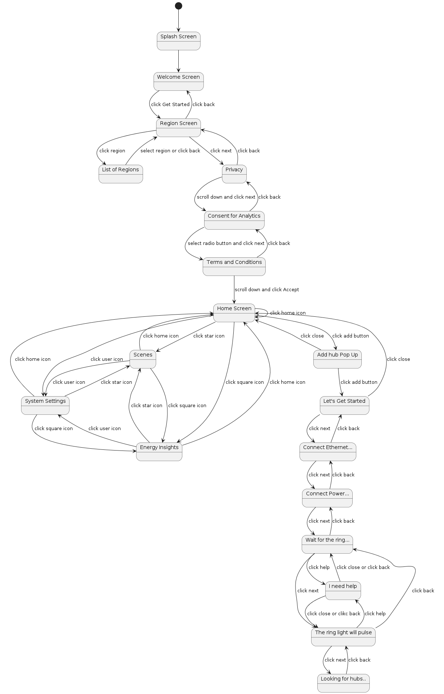

# Test Cases documentation

## Application SM (State Machine)
Next picture shows the aplication flow represented as a SM where every screen is represented as an state an the user actions are the transitions between states.


File [tests.py](../tests/test.py) contains the test set of the main flow where each test verifies each screen in the main flow.
The main flow is the nex sequence
```
Splash Screen --> Region Sceen --> Home Scren --> Looking for hubs
```